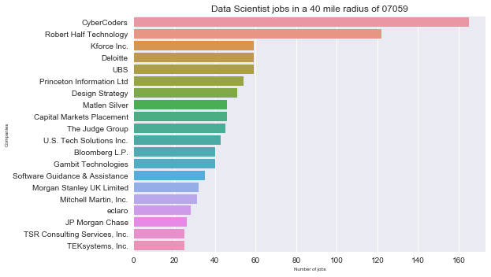
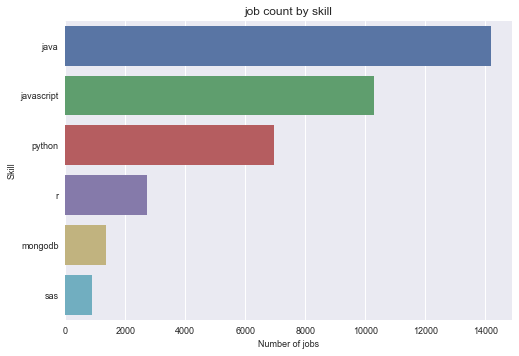

Steps to reproduce the research we presented in the paper.

Requirements:
1. Following python packages must be installed:
	- seaborn
	- plotly
	- pandas
	- matplotlib
	- pymongo
If they are not installed, you can easily install it by running `pip install <package>`
2. MongoDB is installed locally and running on port 27017. If it is running on another port, then modify it accordingly when you make the connection using `pymongo.MongoClient("mongodb://localhost")` in the script.


Question 1: Number of data scientist jobs per state


```python
from analysisCountry import AnalysisCountry

# Create country-level analysis object and pass the jobtype and country code
country = AnalysisCountry("Data Scientist", "US")
```

Use the `country` object to retrieve and store jobs into a collection in MongoDB. Note, the collection name will be lowercased, with no spaces and the country code concatenated to it. In our case, the jobs will be stored into a collection named: datascientistUS


```python
# retrieve jobs from the api and store them in mongodb
country.retrieveAndStoreJobs()
```

    Retrieving jobs from URL:
    http://service.dice.com/api/rest/jobsearch/v1/simple.json?text=data+scientist&country=US
    Dropping collection datascientistUS
    Retrieved 30236 jobs and stored them in MongoDB


`30236` jobs were retrieved from dice API and stored into datascientistUS collection. For our first question, we can get the number of jobs per state in the form of a data frame by calling this method:


```python
df = country.getJobCountAllStates()
```

    Getting job count for all 50 states
    Printing top companies
    jobcount state
        5073    CA
        2475    NY
        2254    TX
        1757    VA
        1745    NJ
        1466    IL
        1275    FL
        1161    GA
        1084    PA
        1068    NC
        1017    MD
         976    MA
         827    WA
         820    CO
         687    MI
         634    OH
         598    DC
         578    AZ
         569    MO
         526    MN
         432    CT
         379    WI
         335    TN
         284    OR
         224    SC
         216    UT
         193    IN
         162    IA
         158    LA
         131    OK
         120    NE
         117    AL
         111    NV
          99    DE
          88    KY
          82    KS
          67    NM
          46    ID
          42    RI
          34    NH
          29    AR
          28    ME
          24    WV
          18    HI
          17    MS
          15    VT
          12    AK
           9    SD
           7    MT
           7    ND
           4    WY


Note: We can pass this data frame to the plotly package and get a heat map showing the distribution of jobs per state. I will show how to do this after answering the remaining 4 questions, as it requires some additional setup. Scroll to the end of the document if you want to see it.

Question 2: Top company within each state


```python
country.getTopCompanyByState()
```

    Group jobs by state and company, display the top company per state
    Display the top company with every state
    company state
                       World Technologies, Inc.    AK
                               NORTHROP GRUMMAN    AL
                      Capital Markets Placement    AR
                                    Kforce Inc.    AZ
                                    CyberCoders    CA
                               NORTHROP GRUMMAN    CO
                                       Deloitte    CT
                                    CyberCoders    DC
                                JP Morgan Chase    DE
                         Robert Half Technology    FL
                         Robert Half Technology    GA
    Kratos Defense and Security Solutions, Inc.    HI
                                     RSM US LLP    IA
                                NetSource, Inc.    ID
                        Request Technology, LLC    IL
                                       Deloitte    IN
                      Capital Markets Placement    KS
                                    CyberCoders    KY
                 Louisiana Economic Development    LA
                                    CyberCoders    MA
                               NORTHROP GRUMMAN    MD
                                         eclaro    ME
            Systems Technology Group Inc. (STG)    MI
                             UnitedHealth Group    MN
                      Capital Markets Placement    MO
                                    CyberCoders    MS
                                    CyberCoders    MT
                         Robert Half Technology    NC
                               NORTHROP GRUMMAN    ND
                                   Aureus Group    NE
                      Albany International Corp    NH
                         Robert Half Technology    NJ
                   Sandia National Laboratories    NM
                         Robert Half Technology    NV
                                    CyberCoders    NY
                                       Deloitte    OH
                         Robert Half Technology    OK
                                   VanderHouwen    OR
                                       Deloitte    PA
                                     CVS Health    RI
                         Robert Half Technology    SC
                   PRIMUS Global Services Inc.,    SD
                                   Zycron, Inc.    TN
                                       Deloitte    TX
                                  Adobe Systems    UT
                               NORTHROP GRUMMAN    VA
                                    CyberCoders    VT
                                    CyberCoders    WA
                                    CyberCoders    WI
                                   Salient CRGT    WV
                               Dish Network LLC    WY


<div>
<table border="1" class="dataframe">
  <thead>
    <tr style="text-align: right;">
      <th></th>
      <th>company</th>
      <th>state</th>
    </tr>
  </thead>
  <tbody>
    <tr>
      <th>0</th>
      <td>World Technologies, Inc.</td>
      <td>AK</td>
    </tr>
    <tr>
      <th>1</th>
      <td>NORTHROP GRUMMAN</td>
      <td>AL</td>
    </tr>
    <tr>
      <th>2</th>
      <td>Capital Markets Placement</td>
      <td>AR</td>
    </tr>
    <tr>
      <th>3</th>
      <td>Kforce Inc.</td>
      <td>AZ</td>
    </tr>
    <tr>
      <th>4</th>
      <td>CyberCoders</td>
      <td>CA</td>
    </tr>
    <tr>
      <th>5</th>
      <td>NORTHROP GRUMMAN</td>
      <td>CO</td>
    </tr>
    <tr>
      <th>6</th>
      <td>Deloitte</td>
      <td>CT</td>
    </tr>
    <tr>
      <th>7</th>
      <td>CyberCoders</td>
      <td>DC</td>
    </tr>
    <tr>
      <th>8</th>
      <td>JP Morgan Chase</td>
      <td>DE</td>
    </tr>
    <tr>
      <th>9</th>
      <td>Robert Half Technology</td>
      <td>FL</td>
    </tr>
    <tr>
      <th>10</th>
      <td>Robert Half Technology</td>
      <td>GA</td>
    </tr>
    <tr>
      <th>11</th>
      <td>Kratos Defense and Security Solutions, Inc.</td>
      <td>HI</td>
    </tr>
    <tr>
      <th>12</th>
      <td>RSM US LLP</td>
      <td>IA</td>
    </tr>
    <tr>
      <th>13</th>
      <td>NetSource, Inc.</td>
      <td>ID</td>
    </tr>
    <tr>
      <th>14</th>
      <td>Request Technology, LLC</td>
      <td>IL</td>
    </tr>
    <tr>
      <th>15</th>
      <td>Deloitte</td>
      <td>IN</td>
    </tr>
    <tr>
      <th>16</th>
      <td>Capital Markets Placement</td>
      <td>KS</td>
    </tr>
    <tr>
      <th>17</th>
      <td>CyberCoders</td>
      <td>KY</td>
    </tr>
    <tr>
      <th>18</th>
      <td>Louisiana Economic Development</td>
      <td>LA</td>
    </tr>
    <tr>
      <th>19</th>
      <td>CyberCoders</td>
      <td>MA</td>
    </tr>
    <tr>
      <th>20</th>
      <td>NORTHROP GRUMMAN</td>
      <td>MD</td>
    </tr>
    <tr>
      <th>21</th>
      <td>eclaro</td>
      <td>ME</td>
    </tr>
    <tr>
      <th>22</th>
      <td>Systems Technology Group Inc. (STG)</td>
      <td>MI</td>
    </tr>
    <tr>
      <th>23</th>
      <td>UnitedHealth Group</td>
      <td>MN</td>
    </tr>
    <tr>
      <th>24</th>
      <td>Capital Markets Placement</td>
      <td>MO</td>
    </tr>
    <tr>
      <th>25</th>
      <td>CyberCoders</td>
      <td>MS</td>
    </tr>
    <tr>
      <th>26</th>
      <td>CyberCoders</td>
      <td>MT</td>
    </tr>
    <tr>
      <th>27</th>
      <td>Robert Half Technology</td>
      <td>NC</td>
    </tr>
    <tr>
      <th>28</th>
      <td>NORTHROP GRUMMAN</td>
      <td>ND</td>
    </tr>
    <tr>
      <th>29</th>
      <td>Aureus Group</td>
      <td>NE</td>
    </tr>
    <tr>
      <th>30</th>
      <td>Albany International Corp</td>
      <td>NH</td>
    </tr>
    <tr>
      <th>31</th>
      <td>Robert Half Technology</td>
      <td>NJ</td>
    </tr>
    <tr>
      <th>32</th>
      <td>Sandia National Laboratories</td>
      <td>NM</td>
    </tr>
    <tr>
      <th>33</th>
      <td>Robert Half Technology</td>
      <td>NV</td>
    </tr>
    <tr>
      <th>34</th>
      <td>CyberCoders</td>
      <td>NY</td>
    </tr>
    <tr>
      <th>35</th>
      <td>Deloitte</td>
      <td>OH</td>
    </tr>
    <tr>
      <th>36</th>
      <td>Robert Half Technology</td>
      <td>OK</td>
    </tr>
    <tr>
      <th>37</th>
      <td>VanderHouwen</td>
      <td>OR</td>
    </tr>
    <tr>
      <th>38</th>
      <td>Deloitte</td>
      <td>PA</td>
    </tr>
    <tr>
      <th>39</th>
      <td>CVS Health</td>
      <td>RI</td>
    </tr>
    <tr>
      <th>40</th>
      <td>Robert Half Technology</td>
      <td>SC</td>
    </tr>
    <tr>
      <th>41</th>
      <td>PRIMUS Global Services Inc.,</td>
      <td>SD</td>
    </tr>
    <tr>
      <th>42</th>
      <td>Zycron, Inc.</td>
      <td>TN</td>
    </tr>
    <tr>
      <th>43</th>
      <td>Deloitte</td>
      <td>TX</td>
    </tr>
    <tr>
      <th>44</th>
      <td>Adobe Systems</td>
      <td>UT</td>
    </tr>
    <tr>
      <th>45</th>
      <td>NORTHROP GRUMMAN</td>
      <td>VA</td>
    </tr>
    <tr>
      <th>46</th>
      <td>CyberCoders</td>
      <td>VT</td>
    </tr>
    <tr>
      <th>47</th>
      <td>CyberCoders</td>
      <td>WA</td>
    </tr>
    <tr>
      <th>48</th>
      <td>CyberCoders</td>
      <td>WI</td>
    </tr>
    <tr>
      <th>49</th>
      <td>Salient CRGT</td>
      <td>WV</td>
    </tr>
    <tr>
      <th>50</th>
      <td>Dish Network LLC</td>
      <td>WY</td>
    </tr>
  </tbody>
</table>
</div>


Question 3: Who is hiring more data scientists in your vicinity ?
To answer this, we need to use the state-level analysis object. 


```python
from analysisState import AnalysisState
# Create analysis object and pass the jobtype and zip code
state = AnalysisState("Data Scientist", "07059")
```

As we are going to get location specific data, instead of querying the country-level collection, we can retrieve jobs in a 40 mile radius and store them in a different collection. The collection name follows the same naming convention as mentioned earlier. All the jobs in a 40 mile radius of 07059 will be stored into: datascientist07059


```python
# retrieve jobs from api and store them in mongodb
state.retrieveAndStoreJobs()
```

    Retrieving jobs from URL:
    http://service.dice.com/api/rest/jobsearch/v1/simple.json?text=data+scientist&city=07059
    Dropping collection datascientist07059
    Count the jobs for a jobTitle and location
    Retrieved 3657 jobs and stored them in MongoDB


```python
# get top20 companies hiring jobtype around the zipcode
state.getTop20Companies(barplot=False)
state.getTop20Companies()
```

    Printing top companies
    Company  JobCount
                       CyberCoders       165
            Robert Half Technology       122
                       Kforce Inc.        59
                          Deloitte        59
                               UBS        59
         Princeton Information Ltd        54
                   Design Strategy        51
                     Matlen Silver        46
         Capital Markets Placement        46
                   The Judge Group        45
          U.S. Tech Solutions Inc.        43
                    Bloomberg L.P.        40
               Gambit Technologies        40
    Software Guidance & Assistance        35
         Morgan Stanley UK Limited        32
             Mitchell Martin, Inc.        31
                            eclaro        28
                   JP Morgan Chase        26
     TSR Consulting Services, Inc.        25
                  TEKsystems, Inc.        25
    Printing top companies





<div>
<table border="1" class="dataframe">
  <thead>
    <tr style="text-align: right;">
      <th></th>
      <th>Company</th>
      <th>JobCount</th>
    </tr>
  </thead>
  <tbody>
    <tr>
      <th>0</th>
      <td>CyberCoders</td>
      <td>165</td>
    </tr>
    <tr>
      <th>1</th>
      <td>Robert Half Technology</td>
      <td>122</td>
    </tr>
    <tr>
      <th>2</th>
      <td>Kforce Inc.</td>
      <td>59</td>
    </tr>
    <tr>
      <th>3</th>
      <td>Deloitte</td>
      <td>59</td>
    </tr>
    <tr>
      <th>4</th>
      <td>UBS</td>
      <td>59</td>
    </tr>
    <tr>
      <th>5</th>
      <td>Princeton Information Ltd</td>
      <td>54</td>
    </tr>
    <tr>
      <th>6</th>
      <td>Design Strategy</td>
      <td>51</td>
    </tr>
    <tr>
      <th>7</th>
      <td>Matlen Silver</td>
      <td>46</td>
    </tr>
    <tr>
      <th>8</th>
      <td>Capital Markets Placement</td>
      <td>46</td>
    </tr>
    <tr>
      <th>9</th>
      <td>The Judge Group</td>
      <td>45</td>
    </tr>
    <tr>
      <th>10</th>
      <td>U.S. Tech Solutions Inc.</td>
      <td>43</td>
    </tr>
    <tr>
      <th>11</th>
      <td>Bloomberg L.P.</td>
      <td>40</td>
    </tr>
    <tr>
      <th>12</th>
      <td>Gambit Technologies</td>
      <td>40</td>
    </tr>
    <tr>
      <th>13</th>
      <td>Software Guidance &amp; Assistance</td>
      <td>35</td>
    </tr>
    <tr>
      <th>14</th>
      <td>Morgan Stanley UK Limited</td>
      <td>32</td>
    </tr>
    <tr>
      <th>15</th>
      <td>Mitchell Martin, Inc.</td>
      <td>31</td>
    </tr>
    <tr>
      <th>16</th>
      <td>eclaro</td>
      <td>28</td>
    </tr>
    <tr>
      <th>17</th>
      <td>JP Morgan Chase</td>
      <td>26</td>
    </tr>
    <tr>
      <th>18</th>
      <td>TSR Consulting Services, Inc.</td>
      <td>25</td>
    </tr>
    <tr>
      <th>19</th>
      <td>TEKsystems, Inc.</td>
      <td>25</td>
    </tr>
  </tbody>
</table>
</div>


Question 4: Total number of employers hiring data scientists in US ?


```python
country.getDistinctEmployers()
```

    Getting distinct employers
    Get distinct employers using distinct


<div>
<table border="1" class="dataframe">
  <thead>
    <tr style="text-align: right;">
      <th></th>
      <th>0</th>
    </tr>
  </thead>
  <tbody>
    <tr>
      <th>0</th>
      <td>Zillow.com</td>
    </tr>
    <tr>
      <th>1</th>
      <td>UPS</td>
    </tr>
    <tr>
      <th>2</th>
      <td>The Rawlings Group</td>
    </tr>
    <tr>
      <th>3</th>
      <td>Stratagem Group</td>
    </tr>
    <tr>
      <th>4</th>
      <td>UnitedHealth Group</td>
    </tr>
    <tr>
      <th>5</th>
      <td>Aarkay Technologies</td>
    </tr>
    <tr>
      <th>6</th>
      <td>ByteCubed</td>
    </tr>
    <tr>
      <th>7</th>
      <td>National Grid</td>
    </tr>
    <tr>
      <th>8</th>
      <td>Cargurus</td>
    </tr>
    <tr>
      <th>9</th>
      <td>North Highland Company</td>
    </tr>
    <tr>
      <th>10</th>
      <td>Federal Reserve Bank</td>
    </tr>
    <tr>
      <th>11</th>
      <td>Coact Inc</td>
    </tr>
    <tr>
      <th>12</th>
      <td>CyberCoders</td>
    </tr>
    <tr>
      <th>13</th>
      <td>Principle Solutions Group</td>
    </tr>
    <tr>
      <th>14</th>
      <td>Mumba Technologies</td>
    </tr>
    <tr>
      <th>15</th>
      <td>MSYS Inc.</td>
    </tr>
    <tr>
      <th>16</th>
      <td>Everest Consultants, Inc.</td>
    </tr>
    <tr>
      <th>17</th>
      <td>Deloitte</td>
    </tr>
    <tr>
      <th>18</th>
      <td>KPMG</td>
    </tr>
    <tr>
      <th>19</th>
      <td>Dimensional Thinking</td>
    </tr>
    <tr>
      <th>20</th>
      <td>Quicken Loans Inc.</td>
    </tr>
    <tr>
      <th>21</th>
      <td>Grant Thornton</td>
    </tr>
    <tr>
      <th>22</th>
      <td>NewData Strategies</td>
    </tr>
    <tr>
      <th>23</th>
      <td>Global Touchpoints Inc.</td>
    </tr>
    <tr>
      <th>24</th>
      <td>Lawrence Harvey</td>
    </tr>
    <tr>
      <th>25</th>
      <td>xScion Solutions</td>
    </tr>
    <tr>
      <th>26</th>
      <td>Princeton Information Ltd</td>
    </tr>
    <tr>
      <th>27</th>
      <td>Amiseq Inc.</td>
    </tr>
    <tr>
      <th>28</th>
      <td>The Robinson Group</td>
    </tr>
    <tr>
      <th>29</th>
      <td>KirkSearch</td>
    </tr>
    <tr>
      <th>...</th>
      <td>...</td>
    </tr>
    <tr>
      <th>4607</th>
      <td>Mitaja Corp</td>
    </tr>
    <tr>
      <th>4608</th>
      <td>Bolder Healthcare Solutions</td>
    </tr>
    <tr>
      <th>4609</th>
      <td>WWF Washington, DC</td>
    </tr>
    <tr>
      <th>4610</th>
      <td>Talentyo LLC</td>
    </tr>
    <tr>
      <th>4611</th>
      <td>Binary Star</td>
    </tr>
    <tr>
      <th>4612</th>
      <td>Trilyon, Inc.</td>
    </tr>
    <tr>
      <th>4613</th>
      <td>CASE Technologies</td>
    </tr>
    <tr>
      <th>4614</th>
      <td>The Geneva Foundation</td>
    </tr>
    <tr>
      <th>4615</th>
      <td>Incipio</td>
    </tr>
    <tr>
      <th>4616</th>
      <td>STA</td>
    </tr>
    <tr>
      <th>4617</th>
      <td>Innovative Solutions</td>
    </tr>
    <tr>
      <th>4618</th>
      <td>West Nyack - THQ</td>
    </tr>
    <tr>
      <th>4619</th>
      <td>Nsight</td>
    </tr>
    <tr>
      <th>4620</th>
      <td>U-Haul International, Inc</td>
    </tr>
    <tr>
      <th>4621</th>
      <td>BlueCross BlueShield of Tennessee</td>
    </tr>
    <tr>
      <th>4622</th>
      <td>AMES</td>
    </tr>
    <tr>
      <th>4623</th>
      <td>Globalsoft Solutions</td>
    </tr>
    <tr>
      <th>4624</th>
      <td>Business Centric Technology</td>
    </tr>
    <tr>
      <th>4625</th>
      <td>Datum Consulting Group, LLC</td>
    </tr>
    <tr>
      <th>4626</th>
      <td>Whitespace Innovations, Inc.</td>
    </tr>
    <tr>
      <th>4627</th>
      <td>Henry M. Jackson Foundation</td>
    </tr>
    <tr>
      <th>4628</th>
      <td>Corporate Brokers, LLC</td>
    </tr>
    <tr>
      <th>4629</th>
      <td>Navdy</td>
    </tr>
    <tr>
      <th>4630</th>
      <td>Fermilab</td>
    </tr>
    <tr>
      <th>4631</th>
      <td>Rocky Mountain Voice &amp; Data/VLCM</td>
    </tr>
    <tr>
      <th>4632</th>
      <td>Core Data Labs</td>
    </tr>
    <tr>
      <th>4633</th>
      <td>FirstBank Data Corporation</td>
    </tr>
    <tr>
      <th>4634</th>
      <td>TDS: Transitional Data Services</td>
    </tr>
    <tr>
      <th>4635</th>
      <td>Q Data Inc</td>
    </tr>
    <tr>
      <th>4636</th>
      <td>Data Computer Corp America</td>
    </tr>
  </tbody>
</table>
<p>4637 rows × 1 columns</p>
</div>


Question 5: Comparison of demand for programming skills in US job market: 


```python
from analysisSkills import AnalysisSkills
# Create skills analysis object and pass a list of skills
list = ["r", "python", "java", "sas", "mongodb", "javascript"]
skills = AnalysisSkills(list, "US")
# get number of jobs per skill
skills.getJobsBySkill(barplot=False)
skills.getJobsBySkill()
```

    Get jobs by skill
    Retrieving job total from URL:
    http://service.dice.com/api/rest/jobsearch/v1/simple.json?text=r&Country=US
    Retrieving job total from URL:
    http://service.dice.com/api/rest/jobsearch/v1/simple.json?text=python&Country=US
    Retrieving job total from URL:
    http://service.dice.com/api/rest/jobsearch/v1/simple.json?text=java&Country=US
    Retrieving job total from URL:
    http://service.dice.com/api/rest/jobsearch/v1/simple.json?text=sas&Country=US
    Retrieving job total from URL:
    http://service.dice.com/api/rest/jobsearch/v1/simple.json?text=mongodb&Country=US
    Retrieving job total from URL:
    http://service.dice.com/api/rest/jobsearch/v1/simple.json?text=javascript&Country=US
       count       skill
    2  14183        java
    5  10310  javascript
    1   6974      python
    0   2711           r
    4   1355     mongodb
    3    900         sas
    Get jobs by skill
    Retrieving job total from URL:
    http://service.dice.com/api/rest/jobsearch/v1/simple.json?text=r&Country=US


    /Users/Shravan/PycharmProjects/TermProject/analysisSkills.py:36: FutureWarning: sort(columns=....) is deprecated, use sort_values(by=.....)
      df = df.sort(['count'], ascending=False)


    Retrieving job total from URL:
    http://service.dice.com/api/rest/jobsearch/v1/simple.json?text=python&Country=US
    Retrieving job total from URL:
    http://service.dice.com/api/rest/jobsearch/v1/simple.json?text=java&Country=US
    Retrieving job total from URL:
    http://service.dice.com/api/rest/jobsearch/v1/simple.json?text=sas&Country=US
    Retrieving job total from URL:
    http://service.dice.com/api/rest/jobsearch/v1/simple.json?text=mongodb&Country=US
    Retrieving job total from URL:
    http://service.dice.com/api/rest/jobsearch/v1/simple.json?text=javascript&Country=US





<div>
<table border="1" class="dataframe">
  <thead>
    <tr style="text-align: right;">
      <th></th>
      <th>count</th>
      <th>skill</th>
    </tr>
  </thead>
  <tbody>
    <tr>
      <th>2</th>
      <td>14183</td>
      <td>java</td>
    </tr>
    <tr>
      <th>5</th>
      <td>10310</td>
      <td>javascript</td>
    </tr>
    <tr>
      <th>1</th>
      <td>6974</td>
      <td>python</td>
    </tr>
    <tr>
      <th>0</th>
      <td>2711</td>
      <td>r</td>
    </tr>
    <tr>
      <th>4</th>
      <td>1355</td>
      <td>mongodb</td>
    </tr>
    <tr>
      <th>3</th>
      <td>900</td>
      <td>sas</td>
    </tr>
  </tbody>
</table>
</div>


Appendix: How to get the US heat map ? 
First go to plot.ly website and register and create an account. The plots will be displayed on their server. You might also need a one-time security token to authenticate with their servers. I am going to show here the code that I used to generate the plot. Plot.ly has stated on their support site that they have a bug in displaying the plot in offline mode within a jupyter notebook. So we are not going to get the map displayed here. But it will be available on their servers.

import plotly.plotly as py

scl = [[0.0, 'rgb(242,240,247)'],[0.2, 'rgb(218,218,235)'],[0.4, 'rgb(188,189,220)'],\
            [0.6, 'rgb(158,154,200)'],[0.8, 'rgb(117,107,177)'],[1.0, 'rgb(84,39,143)']]

df['text'] = df['state'] + '<br>' +\
    'Jobs '+df['jobcount']

data = [ dict(
        type='choropleth',
        colorscale = scl,
        autocolorscale = False,
        locations = df['state'],
        z = df['jobcount'].astype(float),
        locationmode = 'USA-states',
        text = df['text'],
        marker = dict(
            line = dict (
                color = 'rgb(255,255,255)',
                width = 2
            ) ),
        colorbar = dict(
            title = "Number of jobs")
        ) ]

layout = dict(
        title = 'Data Scientist Jobs by State<br>(Hover for count)',
        geo = dict(
            scope='usa',
            projection=dict( type='albers usa' ),
            showlakes = True,
            lakecolor = 'rgb(255, 255, 255)'),
             )

fig = dict( data=data, layout=layout )
py.iplot( fig, filename='d3-cloropleth-map' )


```python

```
